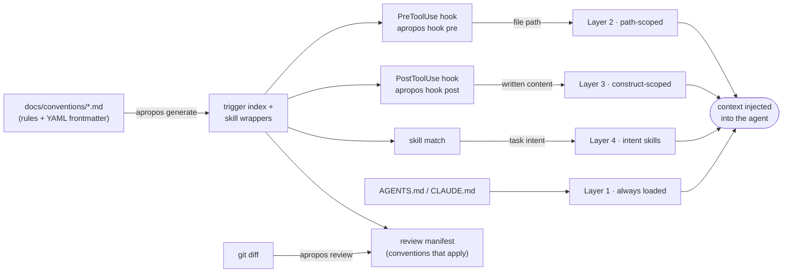

# apropos

**Context injection for AI CLI coding tools — deliver the right documentation at
exactly the right moment.**

*Apropos* — apt, pertinent, timely; said or done at exactly the right moment.
That's the whole design brief: apropos is a single deterministic binary that
keeps a layered documentation structure working. It compiles convention-doc
frontmatter into a trigger index, generates skill wrappers, serves as a hook
handler for supported CLI agents that injects path- and construct-scoped rules
at edit time, and resolves the conventions that apply to a diff for review.

One large always-loaded instruction file gets skimmed and forgotten. apropos
keeps the guidance small and just-in-time: rules live in
[`docs/conventions/`](./docs/conventions/) as markdown with YAML frontmatter,
and apropos delivers each one exactly when the file or construct it governs is
being touched — nothing sooner, nothing later. It makes no LLM calls —
triggering is deterministic — and ships as a static Linux binary.

## Supported CLI agents

- **Claude Code** — PreToolUse/PostToolUse hooks, `AGENTS.md`/`CLAUDE.md`, and generated `SKILL.md` wrappers.
- **OpenCode** — `tool.execute.before`/`tool.execute.after` plugin hooks, same root file and generated skills.
- **Gemini CLI**, **Codex**, **GitHub Copilot CLI**, and **Cursor CLI** — coming soon.

## Install

```sh
curl -fsSL https://raw.githubusercontent.com/NEXL-LTS/apropos/main/install.sh | sh
```

The installer resolves the latest release, verifies its SHA256 checksum, and
installs `apropos` to `$HOME/.local/bin` (override with `APROPOS_BIN_DIR`; pin a tag
with `APROPOS_VERSION`). v1 ships a fully static Linux x86_64 binary; macOS and
Windows are on the roadmap.

From source (requires [Crystal](https://crystal-lang.org) ≥ 1.20):

```sh
make install          # builds the release binary into $PREFIX/bin (default ~/.local/bin)
```

## Quickstart

```sh
apropos init                # bootstrap docs/conventions/, hook wiring, .gitignore
$EDITOR docs/conventions/  # write rules (see docs/conventions/README.md)
apropos generate            # compile the index + skill wrappers
apropos lint                # validate the structure
apropos doctor              # check the environment and hook wiring
```

`apropos init` wires hooks for whichever CLI agents are in play. By default it
auto-detects: if `claude` is on PATH it wires two hooks into
`.claude/settings.json` (`apropos hook pre` → PreToolUse → Layer 2,
path-scoped; `apropos hook post` → PostToolUse → Layer 3, construct-scoped);
if `opencode` is on PATH it generates the OpenCode plugin bridge instead (or
as well). Pass `--tool claude` / `--tool opencode` (repeatable) to wire
specific agents explicitly regardless of PATH. You never run the hooks
themselves by hand — the agent calls them, and they inject the matching
conventions as context.

Run `apropos help` for the full mental model (also `apropos help --format json` for
the machine-readable form, or `apropos help <command>`).

## How it works

Guidance is organized into four layers, each triggered by the cheapest mechanism
that reliably fires it — see [`docs/conventions/README.md`](./docs/conventions/README.md)
for the full model:



| Layer | For | Trigger | Delivered by |
| --- | --- | --- | --- |
| 1 Root file | Universal rules | Always loaded | `AGENTS.md` |
| 2 Path-scoped | A directory / file type | File **path** | PreToolUse hook |
| 3 Construct-scoped | An API / code construct | Written **content** (regex) | PostToolUse hook |
| 4 Intent skills | Task-nature guidance | Semantic skill match | Generated `SKILL.md` |

`apropos generate` compiles the frontmatter in `docs/conventions/` into a cached
trigger index and committed skill wrappers. At edit time, the hooks look up the
matching rules and inject them. For review, the same frontmatter resolves which
conventions apply to a diff, so review prompts carry zero copies of the rules.

## Commands

| Command | Purpose |
| --- | --- |
| `apropos init` | Bootstrap the convention structure into a repo (idempotent; `--tool claude\|opencode` — repeatable, auto-detects by default — plus `--force`, `--example`, `--claude-symlink`, `--dry-run`). |
| `apropos generate` | Compile frontmatter into the trigger index and skill wrappers. `--check` is the CI drift gate. |
| `apropos hook pre` / `hook post` | Hook handlers for the wired CLI agent (Layer 2 / Layer 3). Fail open — never block an edit. |
| `apropos match <paths>` | Resolve the conventions applying to given files (`--format paths\|json\|full`). |
| `apropos review [range]` | Resolve conventions for a git diff range as a review manifest (`--format md\|json`). |
| `apropos lint` | Validate frontmatter, skill descriptions, root-file budget, and generated-artifact freshness (`--strict`). |
| `apropos doctor` | Check hook wiring, agent version/capability support, index freshness, and cache writability. |
| `apropos help` | The dual-audience mental model (human and agent), single-sourced with `--format json`. |

Every command takes `--help`, `--repo-root <dir>` (default: walk up to the nearest
`.git`), and documents its exit codes.

## Design guarantees

- **Fast hooks.** `hook pre`/`hook post` complete in well under 50 ms warm (index
  present); the hot path never parses YAML. A benchmark spec guards the budget.
- **Deterministic output.** `generate` is byte-stable across runs and platforms
  (sorted walks, LF endings, no timestamps) — the prerequisite for `--check`.
- **Fail-open hooks, fail-closed CI.** A hook never blocks or breaks an edit; on
  any internal error it exits 0 and emits nothing. `generate --check` and `lint`
  exit non-zero on any violation.
- **No runtime dependencies.** A fully static musl binary; the only shell-out off
  the hook path is optional `git` for `review`.

## Non-goals (v1)

- No Cursor `.mdc` / Copilot `.instructions.md` output — the frontmatter is
  designed so these are pure additional emitters later.
- No enforcement of code style — that belongs in linters/formatters, which apropos
  does not replace.
- No LLM calls; no daemon/watch mode (every invocation is a fast one-shot).
- No hook management beyond its own entries: apropos edits only the hook entries it
  owns in `.claude/settings.json`, marked and idempotent.

## Roadmap

macOS (arm64/x86_64) and Windows release legs; `--redup-after N` for re-injecting
a rule every N edits; Cursor/Copilot emitters from the same frontmatter; advisory
lint-rule linkage (teaching messages that cite rule files); a `review` posting mode
for CI (GitHub PR comments).

## Development

This repo dogfoods the standard on itself — `docs/conventions/` holds apropos's own
scoped guidance, delivered by apropos's own hooks. Use `make`:

- `make deps` — install shard dependencies
- `make build` — build the debug binary; `make release` for the release build
- `make install` — build and install to `$PREFIX/bin` (default `$HOME/.local`)
- `make check` — lint + spec (the fast local gate)
- `make coverage` — specs under kcov with the 100% line-coverage gate

Development is spec-first, coverage is 100%, and ameba runs zero-findings. See
[`AGENTS.md`](./AGENTS.md) and [`docs/conventions/`](./docs/conventions/).

## License

[MIT](./LICENSE).
